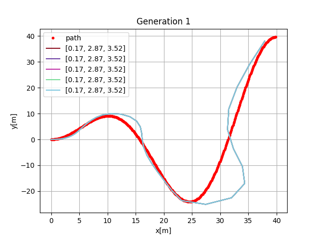
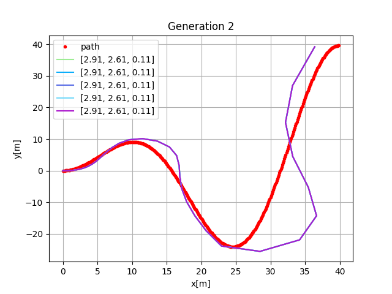
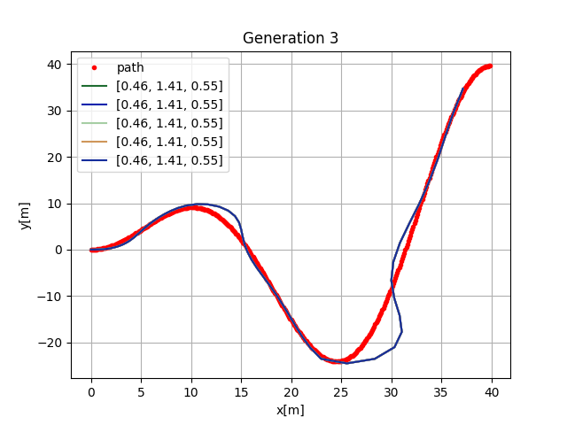
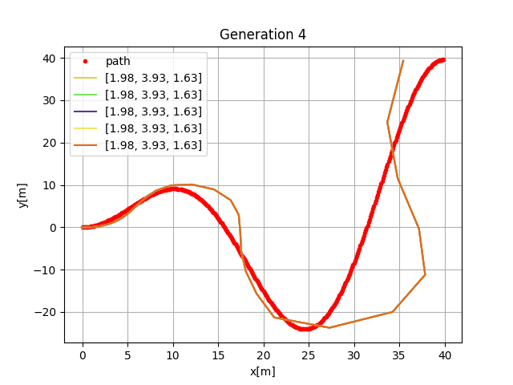
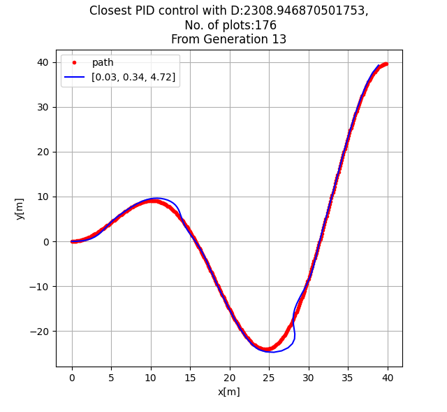

# Genetic Algorithm Project
### - A PID Controller for automating car driving simulation-

The visualization for the car pathing is referenced from here:
> Sakai, A., Ingram, D., Dinius, J., Chawla, K., Raffin, A. and Paques, A., 2022. PythonRobotics: a Python code collection of robotics algorithms. [online] arXiv.org. Available at: <https://arxiv.org/abs/1808.10703> [Accessed 14 May 2022].

In this current commit the formula of the followed path would be:

``%20%5Ctimes%20x)``

which can be edited on function graph() from pure_lineTracker.py

Here is a result from run testing the algorithm:
```





```

